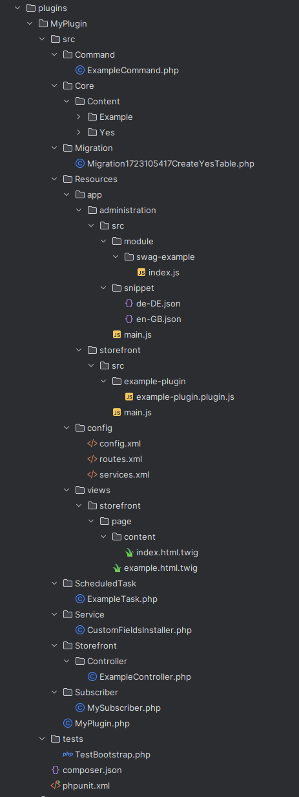

# Learning Objectives

By the end of this unit, you will be able to:

- Know where to place your custom code
- Generate a basic plugin structure via the Shopware CLI
- Recognize where to place your custom code

# Introduction

In this learning unit, you will learn about the basic structure of a Shopware plugin. Understanding the plugin structure is essential for developing custom plugins and extensions for Shopware.

# Plugin structure

Shopware plugins follow a specific directory structure that is important to understand for development. The structure is similar to Symfony bundles, as Shopware is built on the Symfony framework.

Here's a brief overview of the main directories:

```text
<plugin root>
├── src
│   └── MyPlugin
│       └── MyPlugin.php
├── Resources
│   ├── config
│   │   └── services.xml
│   ├── views
│   │   └── storefront
│   │       └── page
│   │           └── product-detail
│   │               └── my_plugin.html.twig
│   └── translations
│       └── en-GB
│           └── storefront
│               └── my_plugin.en-GB.json
├── composer.json
└── README.md
```

This structure is a basic example of a Shopware plugin. The `src` directory contains the plugin's PHP code, while the `Resources` directory contains configuration files, views, and translations.

Don't worry if you don't understand everything yet. We will go through each part in detail in the following learning units. And good news on the creation of all those files and directories, Shopware CLI will help you with that.

# Plugin create command
Shopware comes with a powerful CLI that also helps you with the creation of plugins. To create a new plugin, run the following command:

```shell
bin/console plugin:create
```

This command will ask you the plugin name, namespace, and more. After answering the questions, the CLI will generate the plugin structure for you.


```shell
 Please enter a plugin name (PascalCase):
 > MyPlugin

 Please enter a plugin namespace (PascalCase):
 > MyPlugin

 Do you want to create an example console command? (yes/no) [yes]:
 > yes

 Do you want to create an example scheduled task? (yes/no) [yes]:
 > yes

 Do you want to create an example event subscriber? (yes/no) [yes]:
 > yes

 Do you want to create an example storefront controller? (yes/no) [yes]:
 > yes

 Do you want to create an example store-api route? (yes/no) [yes]:
 > yes

 Do you want to create entities? (yes/no) [yes]:
 > yes

 Please provide a list of entities (PascalCase, comma separated):
 > yes

 Do you want to create an example javascript plugin? (yes/no) [yes]:
 > no

 Do you want to create an example admin module? (yes/no) [yes]:
 > yes

 Do you want to create an example custom fieldset? (yes/no) [yes]:
 > yes
```

Pretty handy for your first playground and to get a feeling for the structure of a plugin and the file naming conventions.



## Plugin class

The MyPlugin class in the `src` directory is the main class of the plugin. It is responsible for registering the plugin and its services with Shopware. The class name should match the plugin name and namespace.

In it, you can define what should happen on installation, uninstallation, activation and update of the plugin. As well as postUpdate and postInstall methods.

```php
<?php declare(strict_types=1);

namespace MyPlugin;

use Shopware\Core\Framework\Plugin;
use Shopware\Core\Framework\Plugin\Context\ActivateContext;
use Shopware\Core\Framework\Plugin\Context\DeactivateContext;
use Shopware\Core\Framework\Plugin\Context\InstallContext;
use Shopware\Core\Framework\Plugin\Context\UninstallContext;
use Shopware\Core\Framework\Plugin\Context\UpdateContext;
use MihoTest\Service\CustomFieldsInstaller;

class MyPlugin extends Plugin
{
    public function install(InstallContext $installContext): void
    {
        // Do stuff such as creating a new payment method

        $this->getCustomFieldsInstaller()->install($installContext->getContext());
    }

    public function uninstall(UninstallContext $uninstallContext): void
    {
        parent::uninstall($uninstallContext);

        if ($uninstallContext->keepUserData()) {
            return;
        }

        // Remove or deactivate the data created by the plugin
    }

    public function activate(ActivateContext $activateContext): void
    {
        // Activate entities, such as a new payment method
        // Or create new entities here, because now your plugin is installed and active for sure

        $this->getCustomFieldsInstaller()->addRelations($activateContext->getContext());
    }

    public function deactivate(DeactivateContext $deactivateContext): void
    {
        // Deactivate entities, such as a new payment method
        // Or remove previously created entities
    }

    public function update(UpdateContext $updateContext): void
    {
        // Update necessary stuff, mostly non-database related
    }

    public function postInstall(InstallContext $installContext): void
    {
    }

    public function postUpdate(UpdateContext $updateContext): void
    {
    }

    private function getCustomFieldsInstaller(): CustomFieldsInstaller
    {
        if ($this->container->has(CustomFieldsInstaller::class)) {
            return $this->container->get(CustomFieldsInstaller::class);
        }

        return new CustomFieldsInstaller(
            $this->container->get('custom_field_set.repository'),
            $this->container->get('custom_field_set_relation.repository')
        );
    }
}
```

You did it, the plugin is now available in the administration panel and can be installed and activated. In the next learning unit, we will go through the possible plugin configurations.

If you are already familiar with the CLI you can also install and activate the plugin via the CLI:

```shell
bin/console plugin:install --activate MyPlugin
```

:::info
Getting all commands for the plugin CLI is easy, just run `bin/console plugin` and you will get a list of all available commands.
:::

```shell
Available commands for the "plugin" namespace:
  plugin:activate    Activate a plugin
  plugin:create      Creates a new plugin
  plugin:deactivate  Deactivates a plugin
  plugin:install     Installs a plugin
  plugin:list        Lists all plugins
  plugin:refresh     Refreshes the plugin list
  plugin:uninstall   Uninstall a plugin
  plugin:update      Updates a plugin
  plugin:update:all  Install all available plugin updates
  plugin:zip-import  Imports a plugin from a zip file
```

